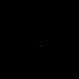
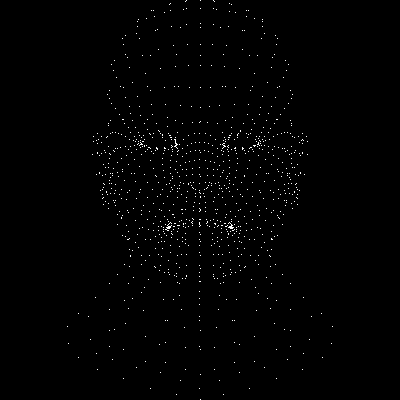

# 从画点开始

## TGAImage

生成图像我们使用TGAImage，这个使用起来很简单：

```C++
#include "tgaimage.h"

const TGAColor white = TGAColor(255, 255, 255, 255);
const TGAColor red   = TGAColor(255, 0,   0,   255);

int main(int argc, char** argv){
  TGAImage image(100, 100, TGAImage::RGB);
  image.set(52, 41, red);
  image.flip_vertically(); // i want to have the origin at the left bottom corner of the image
  image.write_tga_file("output.tga");
  return 0;
}
```

生成的图像（注意中间哪一个小小的红色点）：



[代码](https://github.com/KrisYu/tinyrender/tree/99089f421291612b3d25bbbaf8aadeaee83d0c52)

run：

```
g++
 main.cpp tgaimage.cpp -o main
```


## wavefront obj

然后我们来学习一种3d格式文件，wavefront obj file:

```
# List of geometric vertices, with (x, y, z [,w]) coordinates, w is optional and defaults to 1.0.
  v 0.123 0.234 0.345 1.0
  v ...
  ...
  # List of texture coordinates, in (u, [v ,w]) coordinates, these will vary between 0 and 1, v and w are optional and default to 0.
  vt 0.500 1 [0]
  vt ...
  ...
  # List of vertex normals in (x,y,z) form; normals might not be unit vectors.
  vn 0.707 0.000 0.707
  vn ...
  ...
  # Parameter space vertices in ( u [,v] [,w] ) form; free form geometry statement ( see below )
  vp 0.310000 3.210000 2.100000
  vp ...
  ...
  # Polygonal face element (see below)
  f 1 2 3
  f 3/1 4/2 5/3
  f 6/4/1 3/5/3 7/6/5
  f 7//1 8//2 9//3
  f ...
  ...
  # Line element (see below)
  l 5 8 1 2 4 9
```

我们现在只需要知道了解顶点是v，现在我们想把一个文件中的3d模型的顶点 v (x, y, z) 给画出来，（因为我们已经知道怎么在图上相应的位置放像素）这个文件所有的 x, y, z ∈ [-1, 1]，所以我们

- 需要把它们映射到合适范围。
- 然后注意我们画的点 `image.set(52, 41, red);`, 这里的 52 和 41 是 int，映射之后需要转成int，因为我们总是画在一个一个像素点上。

写一个简单的parser读入文件建立模型，画之。

核心部分长这样：

```C++
for (int i = 0; i != model->nverts(); i++) {
    Vec3f v = model->vert(i);
    Vec2i p = world2screen(v);
    image.set(p.x, p.y, white);
}
```



代码：


run:

```
g++ main.cpp tgaimage.cpp model.cpp -o main
```

