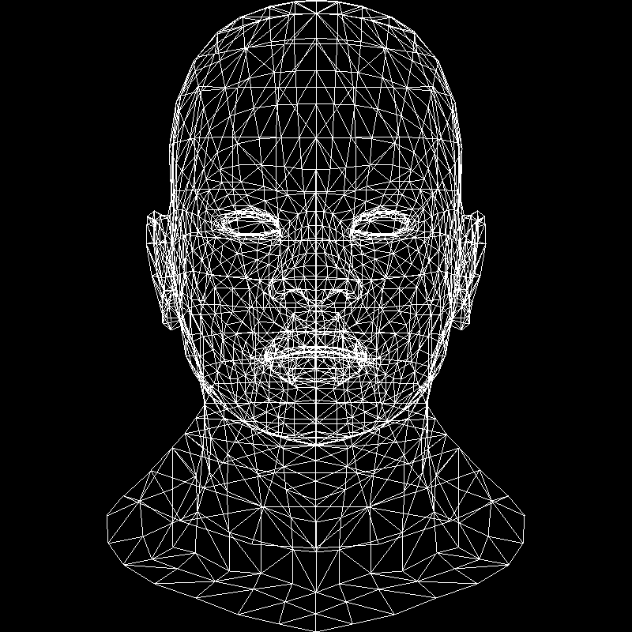

# 画线

画完了点，我们来开始画线。画线的同时我们依旧要记得，我们是画在一个一个整数的pixel上。


## 尝试一： 按照参数绘制直线


```C++ 
void line(int x0, int y0, int x1, int y1, TGAImage &image, TGAColor color) { 
  for (float t=0.; t<1.; t+=.01) { 
    int x = x0 + (x1-x0)*t; 
    int y = y0 + (y1-y0)*t; 
    image.set(x, y, color); 
  } 
}
```

这里的问题有两个：

- 效率低
- t如何控制

t取大了画出来的并不是线，而是一堆点。t取小了会浪费，有很多重复的x和y。

## 尝试二： 按x的增加画线

```C++
void line(int x0, int y0, int x1, int y1, TGAImage &image, TGAColor color) { 
  for (int x=x0; x<=x1; x++) { 
    float t = (x-x0)/(float)(x1-x0); 
    int y = y0 + (y1 - y0)*t; 
    image.set(x, y, color); 
  } 
}
```

我们想着要节约，就每次 x 增加1，然后来画y。

这样画线是对的因为我们假设 $y = mx + b $, 直线斜率m， 截距b

$$
\frac{y_1 - y_0}{x_1 - x_0} = m
$$

$$
y_0 = mx_0 + b
$$

$$
y = y_0 + \frac{y_1 - y_0}{x_1 - x_0}(x - x_0)
$$

所以

$$
y = y_0 + mx - mx_0 = mx + (y_0 - mx_0) = mx + b
$$


同时它的问题是我们也已经指出:

- 如果直线斜率太大，比如 m = 3, 那么x每增加1个像素，y增加3个像素，这样画出来就是分离的点。
- 只能适用于 x0 < x1的状况

## 尝试三

所以想法是：

- 如有必要交换 x0 和 x1，这样使得 x0 一定小于 x1
- 如果斜率比较大，则交换 x 和 y


看代码：

```C++ 
void line(int x0, int y0, int x1, int y1, TGAImage &image, TGAColor color) {
  bool steep = false;
  if (std::abs(x0-x1)<std::abs(y0-y1)) { // if the line is steep, we transpose the image
    std::swap(x0, y0);
    std::swap(x1, y1);
    steep = true;
  }
  if (x0>x1) { // make it left−to−right
    std::swap(x0, x1);
    std::swap(y0, y1);
  }
  for (int x=x0; x<=x1; x++) {
    float t = (x-x0)/(float)(x1-x0);
    int y = y0 + (y1 - y0)*t;
    if (steep) {
        image.set(y, x, color); // if transposed, de−transpose
    } else {
        image.set(x, y, color);
    }
  } 
}
```

这样就可以完善上述出现的问题来画线了。


这里其实还是有一些可以进步的空间，比如出现了浮点数t，同时也依旧我们之前说的我们只需要画在整数上。可以参见： 

[再谈绘制直线](https://zhuanlan.zhihu.com/p/64989645)中的优化部分。

不过我们画线就暂时停在这里。我们就用这个函数来画了，因为compiler的优化已经足够好了。

## wavefront obj

之前我们已经用过这个文件，上次我们认识了v 代表顶点（vertex),这次我们来多认识一个f 代表面（face)，实际上是三角形面，在这个文件中我们的一行f有：

```
f 1193/1240/1193 1180/1227/1180 1179/1226/1179
```

我们现在只需要知道每组的第一个数字： 1193,1180,1179 是代表vertex list中的三个顶点的索引（index），这三个顶点构成一个三角形。

所以进一步修改model parser，我们来用这个画出线框，核心代码长这样：

```C++
for (int i = 0; i < model->nfaces(); i++) {
  std::vector<int> face = model->face(i);
    // face: i0,i1,i2 of triangle
    for (int j = 0; j < 3; j++) {
    Vec3f v0 = model->vert(face[j]);
    // this % used for when j = 2 to get i2, i0
    Vec3f v1 = model->vert(face[(j+1)%3]);
    int x0 = (v0.x+1.)*width/2.;
    int y0 = (v0.y+1.)*height/2.;
    int x1 = (v1.x+1.)*width/2.;
    int y1 = (v1.y+1.)*height/2.;
    line(x0, y0, x1, y1, image, white);
  }
}
```



looks good.

[代码](https://github.com/KrisYu/tinyrender/tree/master/code/02_wireframe)

compile

```
g++ -std=c++11 main.cpp tgaimage.cpp model.cpp -o main
```
