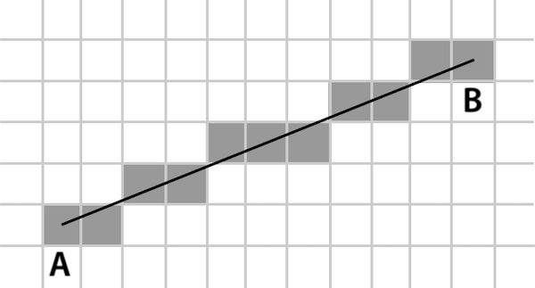
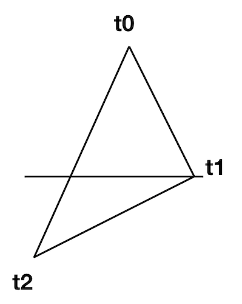
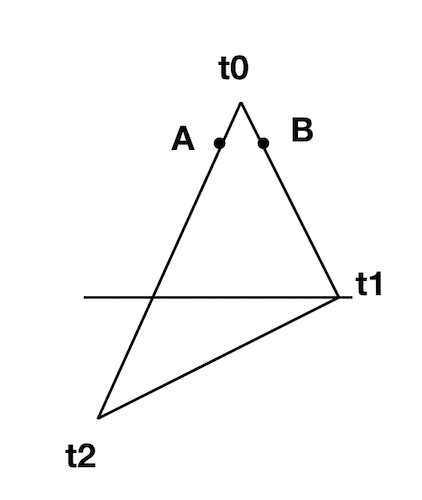
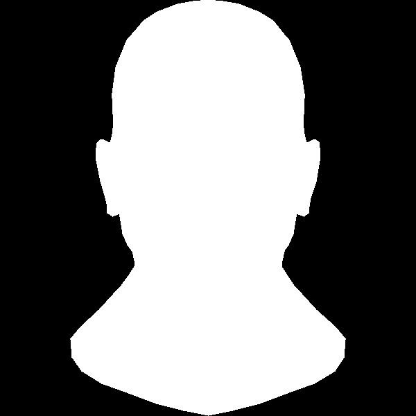
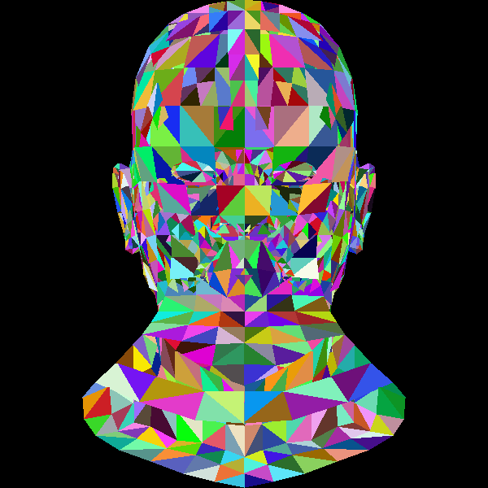

# 填充三角形

## 线性插值


来复习一下画线,我们知道画线的时候我们做的实际上是这样的事情：对于要画的线AB，在满足我们设定的条件（斜率 ≤ 1, A < B）之后，因为我们要画的是整数的像素点，对于x每增加1，我们算出对应的y，然后来画点（x，y），这样重复直到x增加到B点：



对于 AB 上的任意一点 P 满足：

$$
P = A + t(B - A), 0 \le t \le 1
$$

也可以写成：

$$
P = (1 - t)A + tB , 0 \le t \le 1
$$


这个公式是著名的线性插值，实际上也是我们画线的基础。因为在画线部分核心代码长这样：


```C++
for (int x=x0; x<=x1; x++) {
  float t = (x-x0)/(float)(x1-x0);
  int y = y0 + (y1 - y0)*t;
  ...
}
```

对于P点，我们根据增加后的x算出t值，然后算出y，得到应该画的点。


其实在画框架的时候我们已经画过三角形了，就画三条线就OK。现在我们要做的是来填充三角形。


## 扫描法


若要填充一个三角形，最简单的能想到的办法是对于三角形的每一个y，我们找到对应的左侧和右侧，x\_left和x\_right，我们画上x\_left到x\_right的线，那么从三角形最上面的点按y增加扫到最下面的点既可。

为了简单起见，我们先把三角形拆成上下两部分：



那么对于一个特定的y，我们想要找到它的左边和右边 A B 两点，思路是这样：

- 首先排序，保证 t0 ≤ t1 ≤ t2
- 整个三角形的高度必为 t2.y - t0.y
- 那么对于上半部分，y每增加1（注意有可能t0 == t1),我们用插值法算出对应的两点A和B

这样就能算出对应的 A 和 B

 
```C++
void triangle(Vec2i t0, Vec2i t1, Vec2i t2, TGAImage &image, TGAColor color) { 
    // sort the vertices, t0, t1, t2 lower−to−upper (bubblesort yay!) 
    if (t0.y>t1.y) std::swap(t0, t1); 
    if (t0.y>t2.y) std::swap(t0, t2); 
    if (t1.y>t2.y) std::swap(t1, t2); 
    int total_height = t2.y-t0.y; 
    for (int y=t0.y; y<=t1.y; y++) { 
        int segment_height = t1.y-t0.y+1; 
        float alpha = (float)(y-t0.y)/total_height; 
        float beta  = (float)(y-t0.y)/segment_height; // be careful with divisions by zero 
        Vec2i A = t0 + (t2-t0)*alpha; 
        Vec2i B = t0 + (t1-t0)*beta; 
        image.set(A.x, y, red); 
        image.set(B.x, y, green); 
    } 
}
```




那么有了 A 和 B 之后，我们在AB之间调用我们的画线函数，再用同样的方法给下半部分填满，问题既解决。

```C++
void triangle(Vec2i t0, Vec2i t1, Vec2i t2, TGAImage &image, TGAColor color) { 
    // sort the vertices, t0, t1, t2 lower−to−upper (bubblesort yay!) 
    if (t0.y>t1.y) std::swap(t0, t1); 
    if (t0.y>t2.y) std::swap(t0, t2); 
    if (t1.y>t2.y) std::swap(t1, t2); 
    int total_height = t2.y-t0.y; 
    for (int y=t0.y; y<=t1.y; y++) { 
        int segment_height = t1.y-t0.y+1; 
        float alpha = (float)(y-t0.y)/total_height; 
        float beta  = (float)(y-t0.y)/segment_height; // be careful with divisions by zero 
        Vec2i A = t0 + (t2-t0)*alpha; 
        Vec2i B = t0 + (t1-t0)*beta; 
        if (A.x>B.x) std::swap(A, B); 
        for (int j=A.x; j<=B.x; j++) { 
            image.set(j, y, color); // attention, due to int casts t0.y+i != A.y 
        } 
    } 
    for (int y=t1.y; y<=t2.y; y++) { 
        int segment_height =  t2.y-t1.y+1; 
        float alpha = (float)(y-t0.y)/total_height; 
        float beta  = (float)(y-t1.y)/segment_height; // be careful with divisions by zero 
        Vec2i A = t0 + (t2-t0)*alpha; 
        Vec2i B = t1 + (t2-t1)*beta; 
        if (A.x>B.x) std::swap(A, B); 
        for (int j=A.x; j<=B.x; j++) { 
            image.set(j, y, color); // attention, due to int casts t0.y+i != A.y 
        } 
    } 
}
```

这样三角形填充就解决。代码里有很多重复的部分，然后这里决定让代码短一点，代价是读起来没那么清楚了：

```C++ 
void triangle(Vec2i t0, Vec2i t1, Vec2i t2, TGAImage &image, TGAColor color) { 
    if (t0.y==t1.y && t0.y==t2.y) return; // I dont care about degenerate triangles 
    // sort the vertices, t0, t1, t2 lower−to−upper (bubblesort yay!) 
    if (t0.y>t1.y) std::swap(t0, t1); 
    if (t0.y>t2.y) std::swap(t0, t2); 
    if (t1.y>t2.y) std::swap(t1, t2); 
    int total_height = t2.y-t0.y; 
    for (int i=0; i<total_height; i++) { 
        bool second_half = i>t1.y-t0.y || t1.y==t0.y; 
        int segment_height = second_half ? t2.y-t1.y : t1.y-t0.y; 
        float alpha = (float)i/total_height; 
        float beta  = (float)(i-(second_half ? t1.y-t0.y : 0))/segment_height; // be careful: with above conditions no division by zero here 
        Vec2i A =               t0 + (t2-t0)*alpha; 
        Vec2i B = second_half ? t1 + (t2-t1)*beta : t0 + (t1-t0)*beta; 
        if (A.x>B.x) std::swap(A, B); 
        for (int j=A.x; j<=B.x; j++) { 
            image.set(j, t0.y+i, color); // attention, due to int casts t0.y+i != A.y 
        } 
    } 
}
```

## wavefront obj

上一章我们画了框架，这下我们来填上三角形：



好吧，并不是很动人=。=之所以不动人是因为光影光影，我们只有颜色，没有考虑光，

[代码](https://github.com/KrisYu/tinyrender/tree/master/code/03_filledtriangle)

compile:

```
g++ -std=c++11 main.cpp tgaimage.cpp model.cpp -o main
```

## 重心坐标法


除了上面提到的扫描法之外，另外一个可以想到的办法是，因为我们终究是画到二维平面上的像素，一个一个的点，那么对于我们要画的区域内的每一个点，我们是否可以检测看它是否在三角形之内，如果是的话，画它，否则不理之。这样的思路是可行的，对于三角形内及其边上的任意一点，我们都可以用重心坐标系来表示：


$$
P = (1 - u - v)A + uB + vC, 0 \le u,v \le 1
$$

这个长得也很像线性插值。


运算:

$$
P = A + u\overrightarrow{AB}  + v\overrightarrow{AC} 
$$

继续：

$$
u\overrightarrow{AB}  + v\overrightarrow{AC} + \overrightarrow{PA} = 0
$$

PA是AB和AC的线性组合。


拆一拆：

$$
u\overrightarrow{AB}_x  + v\overrightarrow{AC}_x + \overrightarrow{PA}_x = 0
$$

$$
u\overrightarrow{AB}_y  + v\overrightarrow{AC}_y + \overrightarrow{PA}_y = 0
$$

实际上我们都可以看做是我们在寻找向量 $(u, v, 1)$ 同时垂直于向量 $(\overrightarrow{AB}_x, \overrightarrow{AC}_x,\overrightarrow{PA}_x)$ 和向量 $(\overrightarrow{AB}_y, \overrightarrow{AC}_y,\overrightarrow{PA}_y)$。 这就是叉乘。


```
xvector = (B_x - A_x, C_x - A_x, A_x - P_x)
yvector = (B_y - A_y, C_y - A_y, A_y - P_y)
u = xvector x yvector

# 如果 u 的 z 分量不等于1则说明P点不在三角形内
```

因为我们的计算有浮点数，可能u的z分量不会一定等于1,令 u 的三个分量是 (a, b, c),我们代入原式子：

$$
a\overrightarrow{AB}  + b\overrightarrow{AC} + c\overrightarrow{PA} = 0
$$


$$
P = (1 - a/c - b/c)A +  a/cB + b/cC, c \ne 0
$$

代码我们这样写：

```C++
Vec3f barycentric(Vec2f A, Vec2f B, Vec2f C, Vec2f P) {
    Vec3f s[2];
    for (int i=2; i--; ) {
        s[i][0] = C[i]-A[i];
        s[i][1] = B[i]-A[i];
        s[i][2] = A[i]-P[i];
    }
    Vec3f u = cross(s[0], s[1]);
    if (std::abs(u[2])>1e-2) // dont forget that u[2] is integer. If it is zero then triangle ABC is degenerate
        return Vec3f(1.f-(u.x+u.y)/u.z, u.y/u.z, u.x/u.z);
    return Vec3f(-1,1,1); // in this case generate negative coordinates, it will be thrown away by the rasterizator
}
```

我们当然也不用把平面区域的每个点代入P去做检查，我们只需要找到三角形的 bounding_box,然后看其中的每一个整数点，如果在其中，那就画之。

用同样的方法来给模型填色，效果一样。

[代码](https://github.com/KrisYu/tinyrender/tree/master/code/04_barycentricfilled)

效果跟之前依旧一致，我们给每个三角形随机填上色：




随机填色这个我们看起来倒是有点cool.

