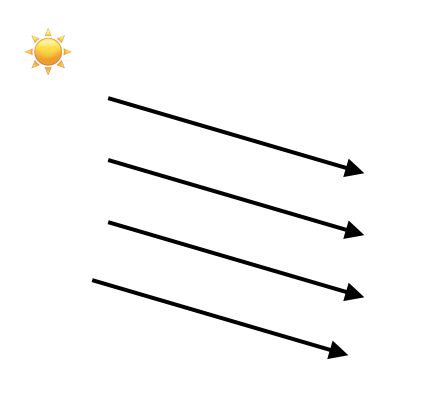

# z-buffer

## 简单光

我们现在先复习一下，我们经过了画点、画线，填三角形之后已经能画出来一些东西了，现在我们有好几条路可以走，那就是 

- 光（上帝说“要有光”）
- 纹理（不然就填白色和随机颜色么？）
- 数学（之前做的所有事情就是简单的把x,y对应的画到图像上来）


这里我们做的事就是简单的给我们的模型一点‘方向光’，注意我这里说了一专有名词‘方向光’，所以还会有别光（暂且不表）。方向光就是类似太阳光一样的，我们只考虑它的方向：



对于一束光，我们到达物体表面的能量实际上是：


它的强度 Icosα， α是物体光与物体的法向量的夹角。

如果我们用$\overrightarrow{L}$表示光的方向，$\overrightarrow{N}$指向物体光照处'向内的'法向量，那么


$$
cos\alpha =  \frac{\overrightarrow{L} \cdot \overrightarrow{N}}{|\overrightarrow{L}| \cdot |\overrightarrow{N}|} ​
$$


这里我们就必须要考虑一些数学问题了，物体我们放在这，然后有光的方向:


那么'朝内的'法向量可以这样得到$\overrightarrow{AC} \times \overrightarrow{AB}$，然后正交化： 


这里我们先做很多简化操作：


- 光的方向是 Vec3f light(0, 0, -1), 强度就是1
- 假设每个三角形收到光照的强度相同，都是 Icosα
- 三角形法向量$\overrightarrow{AC} \times \overrightarrow{AB}$
- 当然我们还要知道 cosα 大于0才有意义，我们不可能减去光o(╯□╰)o


核心代码：

```C++
Vec3f norm = cross(world_coords[2] - world_coords[0], world_coords[1] - world_coords[0]);
norm.normalize();
float intensity = light*norm;
if (intensity > 0) {
  triangle(screen_coords, image, TGAColor(intensity*255,intensity*255,intensity*255,255));
}
```

看效果：


妈妈他是凸嘴。我们换一个光的方向。


更吓人了。。。。他嘴巴怎么长后面了。。


## z-buffer

造成这个问题的原因很简单，我们就是一股脑的把三角形画出来了，没有考虑三角形的先后顺序，正如画画一样，我们应该先画远处的东西，如果近处有什么东西把它给覆盖了，我们就不会看到远处的东西，这里我们就是画三角形的时候没有考虑先后顺序。那么这个问题要怎么解决呢？


这里我们先继续回顾一下三角形重心坐标：

$$
P = (1 - a/c - b/c)A +  a/cB + b/cC, c \ne 0
$$

这里其实有一个很cool的点，就是我们把P表示成三角形三个顶点的线性组合，再回忆一下线性插值，其实对于P点的任何性质，我们都可以利用类似线性插值，把它变成三个顶点的组合：


$$
P_z = (1 - a/c - b/c)A_z +  a/cB_z + b/cC_z, c \ne 0
$$


所以这里就给了我们提示，对于任意一点P，我们算出它的z值，如果z值更小，那么说明它更靠前，我们就用它来替换已经画上的点，否则我们则不更新P点。那么初始我们的P值应该是无穷大。


同样我们也只用考虑画布上的所有的店的P值，可以用一个二维的数组来表示，不过我们这里偷懒，就用一维的数组，因为画布上的(x,y)点可以写成(x + y *width)，可以这样来转换:

```C++
int idx = x + y*width;
```


```C++
int x = idx % width;
int y = idx / width;
```

同时注意我们在把物体坐标系做映射时，需要保留z值，所以一些计算我们最好就用float.同时我们也需要注意在转换坐标系的时候我们需要注意还是需要把 x 和 y 变成int，否则有些地方会因为浮点数的原因for loop不会覆盖所有的像素，会有黑色部分产生：

```C++
Vec3f world2screen(Vec3f v) {
  // 注意这里我们还是保留了int这个操作，因为我们的画像素的for loop要用到这个x和y
  // 如果都是浮点数，那么for loop有些可能无法顺利进行
  // 我们再加上0.5来四舍五入
  return Vec3f(int((v.x+1.)*width/2.+.5), int((v.y+1.)*height/2.+.5), v.z);
}
```

第二个需要注意的点是我们物体的位置，注意物体的朝向，这里我们把z-buffer初始化为负无穷大，然后如果P.z 更大意味更靠近z=0，屏幕，所以这里是跟我们说的有一些相反。


```
void triangle(Vec3f *pts, float *zbuffer, TGAImage &image, TGAColor color) {
  Vec2f bboxmin(std::numeric_limits<float>::max(),std::numeric_limits<float>::max());
  Vec2f bboxmax(std::numeric_limits<float>::min(),std::numeric_limits<float>::min());
  Vec2f clamp(image.get_width()-1, image.get_height()-1);
  for (int i = 0; i < 3; i++) {
    for (int j = 0; j < 2; j++) {
      bboxmin[j] = std::max(0.f,      std::min(bboxmin[j], pts[i][j]));
      bboxmax[j] = std::min(clamp[j], std::max(bboxmax[j], pts[i][j]));
    }
  }
  Vec3f P;
  for (P.x = bboxmin.x; P.x <= bboxmax.x; P.x++) {
    for (P.y = bboxmin.y; P.y <= bboxmax.y; P.y++) {
      Vec3f bc_screen = barycentric(pts[0], pts[1], pts[2], P);
      if (bc_screen.x < 0 || bc_screen.y < 0 || bc_screen.z < 0 ) continue;
      P.z = 0;
      for (int i=0; i<3; i++) P.z += pts[i][2]*bc_screen[i];
      if (zbuffer[int(P.x+P.y*width)] < P.z) {
        image.set(P.x, P.y, color);
        zbuffer[int(P.x+P.y*width)] = P.z;
      }
    }
  }
}
```

看结果:


[代码]

如果你觉得这里的数学计算稍微有点需要转弯的话，不要着急，我们先休息一下，补一点数学知识再回头来继续。


