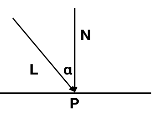

# 简单光

我们现在先复习一下，我们经过了画点、画线，填三角形之后已经能画出来一些东西了，现在我们有好几条路可以走，那就是 

- 光（上帝说“要有光”）
- 纹理（不然就填白色和随机颜色么？）
- 数学（之前做的所有事情就是简单的把x,y对应的画到图像上来）

这里我们做的事就是简单的给我们的模型一点‘方向光’，注意我这里说了一专有名词‘方向光’，看看效果，再考虑别的。方向光就是类似太阳光一样的，我们只考虑它的方向：

对于一束光，我们到达物体表面的能量实际上是：

它的强度 Icosα， α是物体光与物体的法向量的夹角。

如果我们用$\overrightarrow{L}$指向光来的方向，$\overrightarrow{N}$指向物体光照处法向量，那么

$$
cos\alpha =  \frac{\overrightarrow{L} \cdot \overrightarrow{N}}{|\overrightarrow{L}| \cdot |\overrightarrow{N}|} ​
$$

我们这里一个方向光，同时做很多简化操作：

- 有一束方向光找到模型上，我们指向Vec3f指向光来的方向：Vec3f light (0, 0, -1)
- 假设每个三角形收到光照的强度相同，都是 Icosα
- 三角形法向量$\overrightarrow{N}$可以同样由叉乘算出$\overrightarrow{AB} \times \overrightarrow{AC}$
- 当然我们还要知道 cosα 大于0才有意义，我们不可能减去光o(╯□╰)o

按照这个思路写代码：

