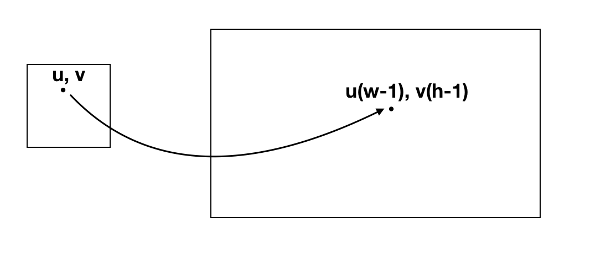
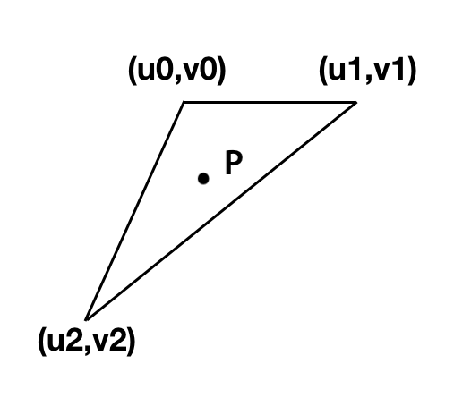
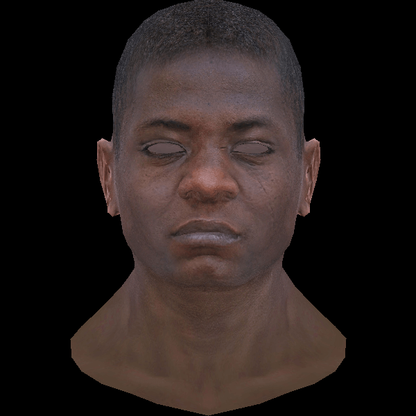

# 纹理

轻松一下，学习一下纹理。

纹理其实就是贴图，比如看这个正方体，如果我们想要它有木质效果。对于它的每一面，我们给它贴上图就ok.


注意只用图的一部分也是完全ok的。

我们定义 u 和 v

 $$
 0 \le u \le 1
 $$
 
 
 $$
 0 \le v \le 1
 $$


(u, v)  会对应到图片(宽w, 高h)上的 (u(w - 1), v(h - 1))，这样定义的的好处当然很多啦， 比如我们可以随意换纹理图，还可以随意换纹理图大小...等等等。



针对每个三角形的顶点我们有 (u, v)， 同样用重心坐标系算出对于三角形的每一点的 (u, v)，然后根据这个 (u, v) 来画图。




## wavefront obj

对于我们的文件，其中有:

```
vt  0.532 0.923 0.000
```

这个数据就是我们三角形对应的(u, v)。

而我们之前读f的时候，丢弃了一些数据，实际上：


```
f 1193/1240/1193 1180/1227/1180 1179/1226/1179
```

实际上三个数据分别是： 顶点索引/顶点法向量索引/顶点纹理索引。


我们来修改model， 给出纹理文件：'african\_head\_diffuse.tga'，读入纹理，然后贴上图看看：



looks good!

代码：


compile & run：

```
$ g++ -std=c++11 main.cpp tgaimage.cpp model.cpp -o main
$ ./main
```
