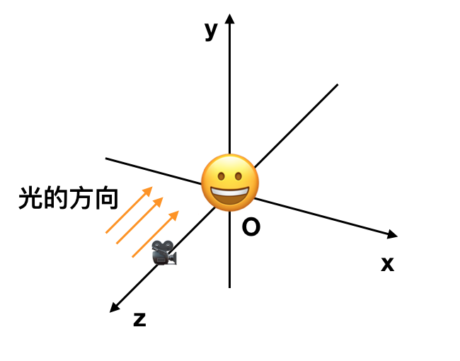
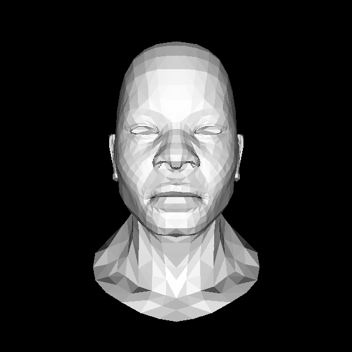

# 数学知识

上一章我们说有三个方向可以走 - 光、纹理、数学。然后我们简单看了一个光的例子来学习z-buffer，现在我们先回一下头，看一下相关的数学知识。这些也很重要。

需要了解的概念包括：

- 矩阵是如何变换向量的: V' = Matrix * V
- 窗口变换、坐标变换: 同样可以用矩阵表示
- 正交投影、透视投影：矩阵表示
- 左手坐标系vs右手坐标系
- ...

这部分可以参考我的一些文章

- [[从零开始计算机图形学]之十四数学知识](https://zhuanlan.zhihu.com/p/63610995) 中的齐次坐标、变换矩阵部分
- [矩阵的逆、坐标变换和窗口变换](https://zhuanlan.zhihu.com/p/66240124)
- [LookAt、Viewport、Perspective矩阵](https://zhuanlan.zhihu.com/p/66384929)
- [左手坐标系vs右手坐标系](https://zhuanlan.zhihu.com/p/64707259)


经过这些补充之后，我们需要知道的是为了变换物体位置，并且符合近大远小的原则我们最终画在屏幕上的点需要经过这些变换：


```
顶点 → 世界坐标系 → 摄像头坐标系 → 投影 → 屏幕坐标系

viewport * projection * view * model * vertex.
```


## 加上数学

这里我们简单用一点点数学，我们不动物体，但是把眼睛/摄像头放到 z = 3 的位置，头像缩小一点点，再加上透视投影。



结果：




看起来不错，近大远小我们能看出来。

[代码] 在geometry.h 中有较大的修改，引入了矩阵类及其运算。


说起数学我们还不能逃开一些问题，比如：

- 我们在代码中没有考虑当我们变换物体的时候，它的法向量会怎样变化？是否可以用同样的矩阵来变换？→ [法向量变换](https://zhuanlan.zhihu.com/p/66669463)
- 我们把物体映射到一个范围，但是不是物体的所有部分都在我们能看到的区域，所以这里还需要一个裁剪步骤，我们暂时不考虑这个问题


