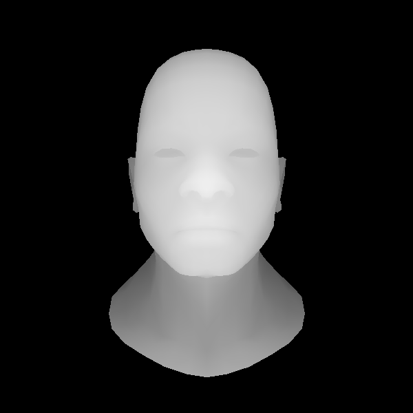
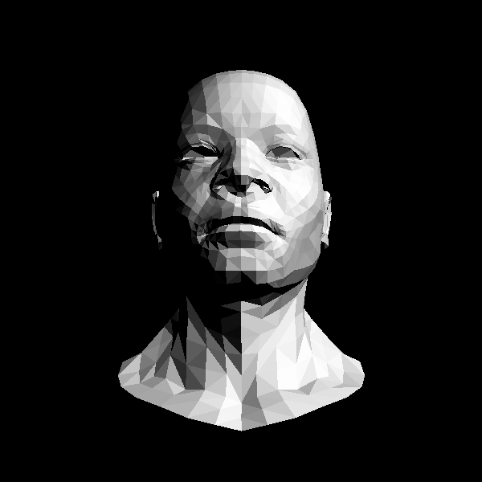

# 平面着色

## 更多的数学

在上一次计算的代码中，我们把模型的坐标$v_x,v_y$映射投影到了一定的区间，其实对于$v_z$我们也可以这样来做。这样可以更多更好的运用我们的齐次坐标，为了方便，我们可以把$v_z$映射到[0,255]之间，这样当然我们的 viewport 矩阵要跟着改了, d = 255:

$$
\begin{pmatrix}
 w/2 & 0 & 0 & x + w/2\\
 0 & h/2 & 0 & y + h/2 \\
 0 & 0 & d/2 & d/2 \\
 0 & 0 & 0 & 1
\end{pmatrix}
$$


我们把$v_z$映射到0~255之间还有一个附加原因（好处）是因为TGAImage支持灰度图像，我们可以利用$v_z$生成一副灰度图像，这样更利于我们debug，同时我们也不需要再使用zbuffer数组了。

看 code 关键部分：

```C++
	float z = pts[0][2]*c.x + pts[1][2]*c.y + pts[2][2]*c.z;
	float w = pts[0][3]*c.x + pts[1][3]*c.y + pts[2][3]*c.z;
	int frag_depth = std::max(0, std::min(255, int(z/w+.5)));
	if (c.x < 0 || c.y < 0 || c.z < 0 || zbuffer.get(P.x, P.y)[0] > frag_depth ) continue;
	image.set(P.x, P.y, color);
	zbuffer.set(P.x, P.y, TGAColor(frag_depth));
```

我们的zbuffer是一幅TGA图像，方便我们直接从中取值，同时z的计算我们变得更加方便了一些，我们也新增了一些几何计算的部分，比如 Vec3f - Vec3i 互相转换， Vec2f - Vec2i 互相转换。

代码：

现在要run就需要：

```
$ g++ -std=c++11 main.cpp tgaimage.cpp model.cpp geometry.cpp -o main
$ .\main
```

生成的output跟之前一样，附加生成了一幅zbuffer的图像：




## 着色

之前写过为了生成这个output，我们加了一束方向光，并做了一些假设：假设每个三角形收到光照的强度相同，都是 Icosα，法向量是我们根据三角形的边叉乘算出来的。

这种给物体上色的方式就叫做平面着色（Flat Shading)，三角形这个平面着一样的色。除了平面着色以外，我们还有别的着色方式： 高洛德着色(Gouraud shading) 和冯氏着色 (Phong shading).

### Gouraud shading

高洛德着色(Gouraud shading) 跟我们处理三角形的z值差不多，算出每个顶点的颜色，然后根据重心坐标，算出三角形内每个P点的颜色，给P点上色。

至于每个顶点的颜色怎么算，别忘了我们的 wavefront file，迄今为止在读f的时候我们丢弃了很多数据：

```
f 1193/1240/1193 1180/1227/1180 1179/1226/1179
```

迄今为止我们只用了第一个数据，顶点的index，实际上三个数据分别是： 顶点索引/顶点法向量索引/顶点纹理索引。

顶点法向量在文件中是 vn开头的数字：

```
vn  0.001 0.482 -0.876
```
有了顶点法向量我们当然就可以算顶点颜色。


纹理坐标是 vt开头的数字，纹理稍后我们跟进：

```
vt  0.532 0.923 0.000
```

修改model文件读入更多的数据。


## Shader

不同的着色方式会有不同的代码，如果我们每次都要回去修改都太麻烦了，这里我们来整理一次代码，让它靠近OpenGL，把顶点变换和着色抽象出来，变成专门的shader部分，也就是所谓的 vertex shader(顶点着色器） 和 fragment shader（片段着色器）。

我们定义一个IShader基类，所有的找色方式都继承和实现里面的 virtual method.

```
struct IShader {
  virtual ~IShader();
  virtual Vec4f vertex(int iface, int nthvert) = 0;
  virtual bool fragment(Vec3f bar, TGAColor &color) = 0;
};
```

顶点着色器主要做两件事：

- 变换顶点
- 准备数据给片段着色器用

片段着色器也主要做两件事：

- 决定当前像素的颜色
- 是否要丢弃当前像素

平面着色器：

```C++
struct FlatShader: public IShader{
  mat<3,3,float> varying_tri; // 用来记录transform之后的三角形

  virtual Vec4f vertex(int iface, int nthvert){
    Vec4f gl_Vertex = embed<4>(model->vert(iface, nthvert));
    gl_Vertex = Projection*ModelView*gl_Vertex;
    varying_tri.set_col(nthvert, proj<3>(gl_Vertex/gl_Vertex[3])); //记录transform后的三角形，这个在我们片段着色器决定三角形的颜色的时候使用来使用
    gl_Vertex = ViewPort*gl_Vertex;
    return gl_Vertex;
  }

  virtual bool fragment(Vec3f bar, TGAColor &color){
    Vec3f n = cross(varying_tri.col(1)- varying_tri.col(0),varying_tri.col(2)-
    varying_tri.col(0)).normalize(); // 计算法向量
    float intensity = CLAMP(n*light_dir); // 光强度clamp到0，1之间
    color = TGAColor(255,255,255)*intensity; // 计算颜色
    return false; 
  }
};
```

之所以我们叫这个为 varying_tri 是因为 **varying**是GLSL中的保留字，我们之后会再聊到它，改变一下光的方向、眼睛位置，看最终效果：




代码:

run:
```
$ g++ -std=c++11 main.cpp tgaimage.cpp model.cpp geometry.cpp our_gl.cpp -o main
$ ./main
```

鉴于我们的compile越来越复杂，用makefile来解决吧.


