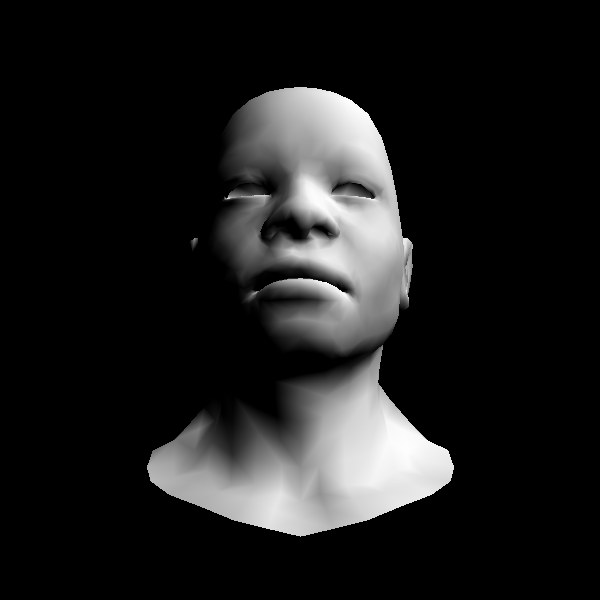

# Gouraud 着色

我们前面已经写过如何Gouraud shading，算出三角形每个顶点的光照，然后根据重心坐标插值上色。

那么我们首先再复习一下我们的代码，非常美妙，抽象了很多部分出来，现在如果我们需要更改着色方式，我们只需要更改 main.cpp 中的 shader部分。所以我们来更改代码，变成Gouraud着色：

```C++
struct GouraudShader: public IShader{
  Vec3f varying_intensity; // write by vertex shader, read by fragment shader

  virtual Vec4f vertex(int iface, int nthvert){
    Vec4f gl_Vertex = embed<4>(model->vert(iface, nthvert)); // read the vertex from obj file
    gl_Vertex = ViewPort*Projection*ModelView*gl_Vertex;
    varying_intensity[nthvert] = CLAMP(model->normal(iface, nthvert)*light_dir); // diffuse light intensity
    return gl_Vertex;
  }

  virtual bool fragment(Vec3f bar, TGAColor &color){
    float intensity = varying_intensity * bar; //interpolate intensity for current Pixel
    color = TGAColor(255,255,255)*intensity;
    return false; // do not discard pixel
  }
};
```

看一下这个跟triangle函数完美的配合：

```C++
void triangle(Vec4f *pts, IShader &shader, TGAImage &image, TGAImage &zbuffer){
  Vec2f bboxmin( std::numeric_limits<float>::max(), std::numeric_limits<float>::max());
  Vec2f bboxmax(-std::numeric_limits<float>::max(),-std::numeric_limits<float>::max());
  for (int i = 0; i < 3; i++) {
    for (int j = 0; j < 2; j++) {
      // x/w y/w
      bboxmin[j] = std::min(bboxmin[j], pts[i][j]/pts[i][3]);
      bboxmax[j] = std::max(bboxmax[j], pts[i][j]/pts[i][3]);
    }
  }

  Vec2i P;
  TGAColor color;
  for (P.x = bboxmin.x; P.x <= bboxmax.x; P.x++) {
    for (P.y = bboxmin.y; P.y <= bboxmax.y; P.y++) {
      Vec3f c = barycentric(proj<2>(pts[0]/pts[0][3]), proj<2>(pts[1]/pts[1][3]),
       proj<2>(pts[2]/pts[2][3]), P);
      float z = pts[0][2]*c.x + pts[1][2]*c.y + pts[2][2]*c.z;
      float w = pts[0][3]*c.x + pts[1][3]*c.y + pts[2][3]*c.z;
      int frag_depth = std::max(0, std::min(255, int(z/w+.5)));
      if (c.x < 0 || c.y < 0 || c.z < 0 || zbuffer.get(P.x, P.y)[0] > frag_depth ) continue;
      bool discard = shader.fragment(c, color);
      if (!discard) {
        zbuffer.set(P.x, P.y, TGAColor(frag_depth));
        image.set(P.x, P.y, color);
      }
    }
  }
}
```

我们把重心坐标系传入 fragment，这个坐标系会根据三个顶点的光照来计算出这个点的光照，给出对应像素的颜色。

当然也少不了我们的main函数：

```C++
  GouraudShader shader;
  for (int i = 0; i < model->nfaces(); i++) {
    std::vector<int> face = model->face(i);
    Vec4f screen_coords[3];
    for (int j = 0; j < 3; j++) {
      screen_coords[j] = shader.vertex(i, j); //处理每个三角形
    }
    triangle(screen_coords, shader, image, zbuffer);
  }
```




looks good.

[代码]()
