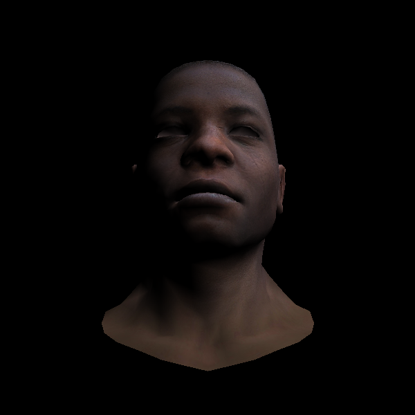
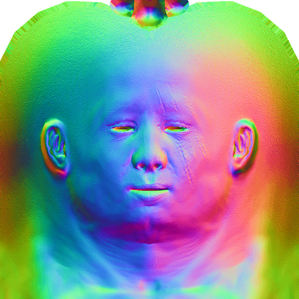
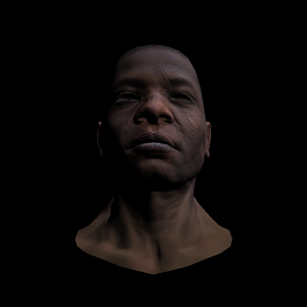
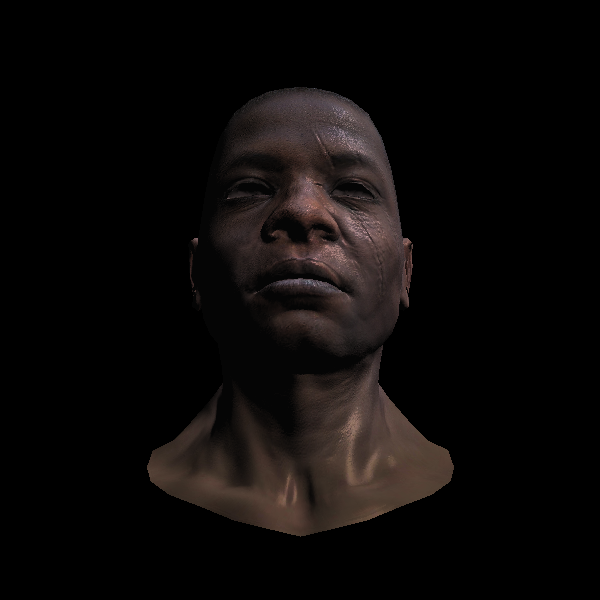

# Phong光照模型

先注意标题： Phong光照模型，光照模型并不是着色，不要把这个和Phong着色弄混。


## 再次纹理

我们再次来看纹理，之前我们添加纹理的时候没有加光照，没有做投影。现在我们把纹理加到我们现有的系统中：

```C++
struct Shader: public IShader{
  Vec3f varying_intensity; // write by vertex shader, read by fragment shader
  mat<2,3,float> varying_uv; // write by vertex shader, read by fragment shader

  virtual Vec4f vertex(int iface, int nthvert){
    varying_uv.set_col(nthvert, model->uv(iface, nthvert));
    varying_intensity[nthvert] = CLAMP(model->normal(iface, nthvert)*light_dir); // diffuse light intensity
    Vec4f gl_Vertex = embed<4>(model->vert(iface, nthvert)); // read the vertex from obj file
    return ViewPort*Projection*ModelView*gl_Vertex;
  }

  virtual bool fragment(Vec3f bar, TGAColor &color){
    float intensity = varying_intensity * bar; //interpolate intensity for current Pixel
    Vec2f uv = varying_uv * bar; //interpolate uv for current Pixel
    color = model->diffuse(uv)*intensity;
    return false; // do not discard pixel
  }
};
```

[代码](https://github.com/KrisYu/tinyrender/tree/master/code/12_texture_again)


最终效果：



## 法向量插值

有了这张纹理图，我们就可以根据插值法得到每一个像素的纹理。不禁让人思考，除了纹理，我们还可以把什么也存在图像中呢？答案是-很多：颜色、方向甚至温度。

这张图，如果我们把RGB值翻译成 xyz，那么这张图会给我们每个pixel的法向量值。这样就不仅仅是顶点的法向量了。



 
我们像加载法向量，修改shader，再次生成图像：



看起来更加生动,看核心代码，我们读入了每个像素的法向量，根据每个像素做计算，这里也用到了之前写的法向量变换。


```C++
struct Shader: public IShader{
  mat<2,3,float> varying_uv; // write by vertex shader, read by fragment shader
  mat<4,4,float> uniform_M; //Projection*ModelView
  mat<4,4,float> uniform_MIT; // (Projection*ModelView).invert_transpose()

  virtual Vec4f vertex(int iface, int nthvert){
    varying_uv.set_col(nthvert, model->uv(iface, nthvert));
    Vec4f gl_Vertex = embed<4>(model->vert(iface, nthvert)); // read the vertex from obj file
    return ViewPort*Projection*ModelView*gl_Vertex; // transform to screen coords
  }

  virtual bool fragment(Vec3f bar, TGAColor &color){
    Vec2f uv = varying_uv*bar; //interpolate uv for current Pixel
    Vec3f n = proj<3>(uniform_MIT*embed<4>(model->normal(uv))).normalize(); // transform normal vector
    Vec3f l = proj<3>(uniform_M  *embed<4>(light_dir)).normalize(); // transfrom light direction
    float intensity = std::max(0.f, n*l);
    color = model->diffuse(uv)*intensity; //uv
    return false; // do not discard pixel
  }
};
```

还需要注意的是从图像中颜色我们用的是TGAColor，它的顺序是bgra.具体的可以看一下在model中新增的normal函数.

[代码](https://github.com/KrisYu/tinyrender/tree/master/code/13_normal)


## Phong 光照模型 

Phong提出我们可以把最终光的效果看为：

环境 + 漫反射 + 镜面 = Phong


其实光我们也可以分模型：环境光、方向光、点光源。

specular light 具体的计算式子是：

$$
I_s = I_L(\frac{\overrightarrow{N} \cdot \overrightarrow{V}}{|\overrightarrow{N}| |\overrightarrow{V}|})^s
$$

- $I_L$: 光射入方向
- $\overrightarrow{N}$: 法向量
- $\overrightarrow{V}$: 摄像机方向
- s：高光

所有的光加起来的公式是：

$$
I = I_A + \sum I_D\frac{I_D \cdot \overrightarrow{N}}{|I_D||\overrightarrow{N}|} + \sum I_L(\frac{\overrightarrow{N} \cdot \overrightarrow{V}}{|\overrightarrow{N}| |\overrightarrow{V}|})^s
$$

完整的关于这个式子推理可见：

[[从零开始计算机图形学]之二漫反射](https://zhuanlan.zhihu.com/p/63343562)

[[从零开始计算机图形学]之三高光](https://zhuanlan.zhihu.com/p/63350881)

我们同样用一幅图来表示图中每个像素所在点的反射（镜面）系数。加载上镜面系数，看最终结果：



可以看到右侧脸，脖子还是有比较明显的‘镜面高光’效果。cool.

核心代码:

```C++
struct Shader: public IShader{
  mat<2,3,float> varying_uv; // write by vertex shader, read by fragment shader
  mat<4,4,float> uniform_M; //Projection*ModelView
  mat<4,4,float> uniform_MIT; // (Projection*ModelView).invert_transpose()

  virtual Vec4f vertex(int iface, int nthvert){
    varying_uv.set_col(nthvert, model->uv(iface, nthvert));
    Vec4f gl_Vertex = embed<4>(model->vert(iface, nthvert)); // read the vertex from obj file
    return ViewPort*Projection*ModelView*gl_Vertex; // transform to screen coords
  }

  virtual bool fragment(Vec3f bar, TGAColor &color){
    Vec2f uv = varying_uv*bar; //interpolate uv for current Pixel
    Vec3f n = proj<3>(uniform_MIT*embed<4>(model->normal(uv))).normalize(); // transform normal vector
    Vec3f l = proj<3>(uniform_M  *embed<4>(light_dir)).normalize(); // transfrom light direction
    Vec3f r = (n*(n*l*2.f) - l).normalize(); // reflected light
    float spec = pow(std::max(r.z, 0.0f), model->specular(uv)); // we're looking from z-axis, 
    float diff = std::max(0.f, n*l);
    TGAColor c = model->diffuse(uv);
    color = c;
    for (int i = 0; i < 3; i++) color[i] = std::min<float>(5+c[i]*(diff+.6*spec),255);
    return false; // do not discard pixel
  }
};
```

这里的fragment shader中我们增加了r作为镜面反射光，然后镜面系数是从图像中读出，同样，我们也只会取大于0的部分。

```C++
    for (int i = 0; i < 3; i++) color[i] = std::min<float>(5+c[i]*(diff+.6*spec),255); \\5 是环境光，diff， spec*0.6这里有点随意分配的意思（一般来说我们所有光的强度加在一起最好不要超过1)，然后最大值是255，毕竟颜色不能超过这里。
```


[代码]
